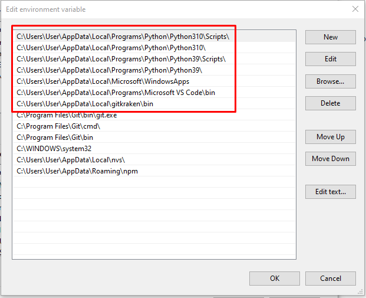

# Index Page

## How to install in cmd line
I am using vscode so just create a new terminal and then do the following

To avoid all types of issues i would suggestion uninstalling anaconda and all of your python installations, unless you know for sure that you need those previous versions for other projects and everything ... or if you are familar with python already and you know what you are doing you can keep them ... but there have been many pathing issues with having different versions and anaconda installed.

So if you do not need to do any of this then you can move to the next section ... but if you do need to unisntall then go an uninstall all of them ... then go to the python website and download python 3.10.10 and then make sure you select add to path when installing and also install for all users.

Also if you have any spaces in the names of your folders make sure you put quotes around the whole thing like "E:/Coding/virtual environments/qfFree/Scripts/activate.bat" ... as you can see i have a space in virtual environments ... so i was getting errors if i ever needed to copy and past a specific directory

be sure do download git
download vscode
make a folder called coding
change cmd prompt to default in vscode
go back one folder after creating cloned repo in terminal cd ..
clone the repository in the welcmoe or cmd thing for vscode backtester folder
config temrinal settings to cmd promot as default cntl shift p terminal select default profile click on cmd prompt
change your cd in the cmd promot folder to a folder where you want the venv 
create venv in folder
ipython kernel install --user --name=qfFree
activate
install gitlens so you can see branches and remotes
pip install from backtester folder pip install -e "blhablhab"
you have to make sure you have auto save on if you want to have your commits auto showing up in source control or you have to save the file before it shows up
make sure you have auto save set to after delay if you want it to auto update
                                


inside of your terminal in vscode ... first make you are in the folder you want to actually create your vertual env
Create a new virtual environement by typing this into your command line

```
python -m venv qfFree
```

Now we need to activate the newly created venv
```
qfFree\Scripts\activate
```

last if you still have your ven active then copy past the following pip install
```
pip install -U git+https://github.com/QuantFreedom1022/quantfreedom
```

If you want to work on the dev branch then use this instead. But be warned ... it is called dev for a reason lol.
```
pip install -U git+https://github.com/QuantFreedom1022/quantfreedom@dev
```

If you want to also install the packages that let you build documentation to your changes then add [web] at the end.
```
pip install -U git+https://github.com/QuantFreedom1022/quantfreedom[web]
```

You now should have created a veritual environment

Installation Problems

!!! warning "Installation Problems"
    If you have any trouble or run into installation errors then what i have found is if i shutdown vscode then open it back up and then reactivate my virtual environment then pip install again it is able to make the full install
