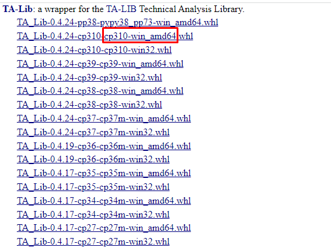

# Index Page

## How to install via cmd line using vs code
If you have any problems along the way make sure you message me and let me know what you are having a problem with ... i want these installation instructions to be perfect so anyone can install 

I am using vscode because it is so easy to use and you can use jupyter notebooks in it for free

Before we start:

To avoid all types of issues i would suggestion uninstalling anaconda and all of your python installations, unless you know for sure that you need those previous versions for other projects and everything ... or if you are familiar with python already and you know what you are doing you can keep them ... but there have been many pathing issues with having different versions and anaconda installed.

So if you do not need to do any of this then you can move to the next section ... but if you do need to uninstall then go and uninstall all of your python versions and anaconda versions ... then go to the python website and download python 3.10.10 and then make sure you select add to path when installing and also install for all users. https://www.python.org/downloads/

Then make sure you have git installed ... if you don't go to the git website and download git and install. To the best of my knowledge all you need to do is just hit next for everything but i also suggest at least reading some of the options. https://git-scm.com/downloads

you may run into problems later on with git saying you need to fonfigure your user name and user email ... to check this in the cmd terminal type in git config --global --list ... then you should see your user email and user name ... for github ... if you don't then type git config --global user.name "your_username" git config --global user.email "your_email_address@example.com"

once you have git and python installed we need to check to make sure you were able to add everything to the path properly so press your windows key and type edit the system environment variables then click on environment variables then double click on path and make sure your python 310 scripts and python 310 are at the top then you want your vs code bin below it ... so your order should look something like mine but i think the most important is that the python version you want to use is first

Now download vs code https://code.visualstudio.com/download and then go to the extensions tab and install python, jupyter and gitlens and also python environment manager

once you have vscode installed launch it and then press ctrl shift p and then type in terminal select default profile .. then make sure you select cmd prompt as the default

now you want to go to a location on your computer and create a folder called coding because this is where you will store your virtual environment and possibly the cloned repo

if you want to help develop the backtester then go to the github link and star and fork the project https://github.com/QuantFreedom1022/QuantFreedom ... if not skip to the next step

once you have forked it then grab the code of your forked project from the code button and copy the link

once you have the link copied then go back to vs code and press ctrl shift p and type git clone and then past the link of the code or if you are signed into your github you can select the new fork from the drop down list

i would then suggest cloning to the coding folder that you made

ok this part is for everyone

before we create the virtual env you have to make sure you are using the cmd prompt so go to terminal in the menu and select new terminal and then once the terminal pops up make sure you are in the cmd prompt. if you aren't and have changed your default to the cmd prompt then close out your vs code and open it again and it should work this time. It is super important that we are in the cmd prompt or this installation wont work

if you are in the cmd prompt then make sure the folder location for the cmd prompt is the coding folder ... if it isn't use cd and type in the location of the coding folder like cd "C:\users\my stuff\coding" ... make sure you use quotes because if you have spaces in some of your folder names you have to have quotes

now that you are in the right folder we want to type python -m venv qfFree ... this will create a virtual env named qfFree

next we want to type qfFree\Scripts\activate to activate the virtual env ... this will make sure anything we install is in the virtual env and not on our global python which is super extra important

now we need to create a jupyter notebook kernel by typing this ipython kernel install --user --name=qfFree

if you want to install the dev env then you have to type pip install -e then the location of your cloned repo like "C:\user\mystuff\coding\QuantFreedom" this will then install the backtester

if you are just installing to use the backtester then type pip install -U git+https://github.com/QuantFreedom1022/quantfreedom

once we have our venv created and everything is pip installed then we want to do control shift p and type select Interpreter to start jupyter server and then select the venv we just created that way it selects that venv every time we use jupyter

also make sure you have auto save on by going to file preferences setting then type auto save and then select after delay ... for people working in dev env this is for making sure you see the auto updates in the source control for pushing new data and for people who are just working you always want your data saved ... unless you don't you can choose another auto save or turn it off

make sure you are on the dev branch and then fetch the upstream then right click on the dev upstream and merge into current branch ... then sync your changes to update your origin branch

You now should have created a virtual environment

if you are using the dev env if you want to get the latest updates from my repo to keep your forked repo up to date then in the source control section of vs code which is usually under the magnified glass the weird looking 3 circle thing ... if you installed git lens you should see remotes and branches

click on remotes and you should see upstream ... what you need to do is make sure you right click on upstream and do fetch all ... if you see there are updates then which ever branch you are on locally which you can tell in the lower left corner of the vscode window it should say dev or main or some branch name then you right click on the same name for upstream and select merge branch into current branch ... this will get all the changes from my repo and put them on your local hard drive ... then you need to sync those changes to your forked branch by just clicking sync changes

this is why i highly highly highly suggest you work from your own folder and don't edit any original code because if you work on the same file as me and there are updates from both of us then there will be merge problems

i would suggest making your own tests folder and also your own folder inside quantfreedom folder ... if you make your own folder in quantfreedom then make sure you add it to the _init_.py file inside the quant freedom or it wont work ... then you have to add init.py files to all the folders you make inside of your folder ... you want to do this to avoid merging problems

This should be it ... i highly suggest watching the video about installation as i know i am probably missed some things ... but if i do please let me know so i cam make these instructions better ... also don't forget to install talib

Installation Problems

!!! warning "Installation Problems"
    If you have any trouble or run into installation errors then what i have found is if i shutdown vscode then open it back up and then reactivate my virtual environment then pip install again it is able to make the full install
## Install TA-Lib
To install ta lib you need to do the following

- Go to this website https://www.lfd.uci.edu/~gohlke/pythonlibs/#ta-lib 
- Download the one that has your python version. You can check your python version ( i run python 3.10.10 on a 64bit windows machine so i am going to choose cp310 ) ... if you don't know your python version in the terminal type python --version.

- Once you downloaded the file you need to change your folder path in the terminal by doing cd (download location of folder)
- Once there type in pip install ( full file name of the talib wheel you downloaded)